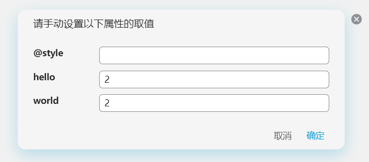
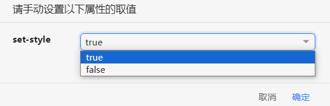

Quickly add block attributes.

## Basic Usage

* Configure block attribute templates defined in JSON in the settings.
* Textarea supports auto-indentation, using tab to indent and shift+tab to unindent.

### Attribute Template Configuration

For example, if you configure the following JSON in the settings:

```json
{
  "Example1": {
    "attr1": "value",
    "attr2": "true"
  },
  "Example2": {
    "attr3": "value"
  }
}
```

Then clicking on the block icon， it will display two menus: "Example 1" and "Example 2". Clicking on "Example 1" will add custom attributes `attr1` and `attr2` to the block.

Note:

* Only english character, number, `-`, `_` are permitted as an attribute's name
* The default value for attributes can only be a string.

  For example, you should write "true" instead of true, and write "0" instead of 0.

## Setting built-in attributes

Normal user defined attributes will be set to custom attributes, e.g. `attr` will be set to `custom-attr`.

If you don't want attributes to be prefixed with `custom-`, as is the case with some built-in attributes, you can prefix the attribute name with the `@` symbol, for example: `@name`: Sets the name of the block to be named.

* `@name`: sets the block name
* `@alias`: sets the block alias.
* `@memo`: sets the block memo.
* `@bookmark`: set the bookmark of the block
* `@style`: sets the inline style of the block.

For example:

```json

{
  "Test block attr": {
    "@name": "test",
    "@alias": "Alias",
    "@memo": "Memo",
    "@bookmark": "Test",
    "@style": "font-size: 1.5em; background-color: red;"
  }
}
```

## Block Attribute Filtering

The above usage will take effect on all blocks. If you only want it to apply to specific types of blocks, you can use the filtering syntax:

```json
{
  "Example 1": {
    "attr1": "value",
    "attr2": "true"
  },
  "@type/d": {
    "Example 2": {
      "attr1": "value"
    }
  }
}
```

As shown above, the template defined under `@type/d` will only appear in the menu of document blocks. The supported block types are as follows:

| prompt | Block Type      |
| -------- | ----------------- |
| `@type/d`       | Document Block  |
| `@type/h`       | Heading Block   |
| `@type/p`       | Paragraph Block |
| `@type/l`       | List Block      |
| `@type/li`       | List Item Block |
| `@type/q`       | Quote Block     |
| `@type/c`       | Code Block      |
| `@type/t`       | Table Block     |
| `@type/s`       | Super Block     |

## `/` Command

By setting the `@slash` attribute, you can quickly add corresponding attributes to the block being edited by entering the `/` command in the editor.

Example:

```json
{
  "TODO": {
    "@slash": "todo",
    "todo-status": "TODO"
  },
  "DONE": {
    "@slash": "done",
    "todo-status": "DONE"
  }
}
```

So, when you enter `/todo` in the editor, the corresponding block will be quickly assigned the attribute `custom-todo-status=TODO`.


### `@type/` Subcommands with `@slash`

When an template marked with `@slash` is defined under `@type/`, the plugin will search upwards when setting the attribute to find the nearest container block that meets the `@type/` condition, and then add the attribute to this container block.

For example:

```json
{
  "@type/d": {
    "Title": {
      "@slash": "title",
      "title": "Title"
    }
  }
}
```

When you input `/title` in any paragraph block in the editor, it will search upwards to find the corresponding document block and then add the attribute `custom-title=Title` to the document block.

> ⚠️ Note: This feature is only effective for container blocks.
> For example, a heading block is not a container block, so the `@slash` command under `@type/h` may not add attributes to the nearest heading block as expected.


## Using the `@value` Feature

When we set an attribute's value to `@value/xxx`, we can input the specified attribute's value in a pop-up dialog box.

### `@value/input`

An attribute declared with `@value/input` will create a text box to input its value.

Example:

```json
{
  "Set Inline Style": {
    "@style": "@value/input",
    "set-style": "true",
    "hello": "@value/input",
    "world": "@value/input"
  }
}
```

In this feature:

* Automatically sets `custom-set-style=true`
* `style`, `custom-hello`, `custom-world` will pop up a dialog box for you to enter values



### `@value/select`

An attribute declared with `@value/select` will create a dropdown select box to choose its value.

The syntax is `@value/select:<val>`, with different options separated by `;` or `,`.

Example:

```json
{
  "Set Inline Style": {
    "set-style": "@value/select:true;false"
  }
}
```




## 📝 Note: Common JSON Format Errors

When using JSON to configure rules, correct formatting is crucial. Here are some common JSON format errors and their respective solutions:

#### 1. Use Correct Quotation Marks
The JSON standard only accepts double quotation marks ("") to enclose keys (keys) and string values (string values). Using single quotation marks (''') or not using quotation marks at all will result in a parse error.

Incorrect example:
```json
{ 'name': 'value' }
```
Correct example:
```json
{ "name": "value" }
```

#### 2. Do Not Add a Comma After the Last Key-Value Pair
In JSON, there should not be a comma after the last element in a key-value pair list. Although some JavaScript engines can tolerate trailing commas, they are not part of the standard JSON.

Incorrect example:
```json
{
  "name": "value",
}
```
Correct example:
```json
{
  "name": "value"
}
```
