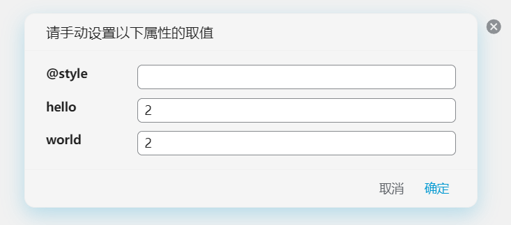

快速添加块属性。

### 基本用法

- 在设置中配置 Json 定义的块属性模板。
- 设置面板的文本编辑框支持基本的 Tab 缩进、Shift+Tab 反缩进的功能。

#### 语法规则

例如你在设置中配置了如下的 Json：

```json
{
  "样例1": {
    "attr1": "value",
    "attr2": "true"
  },
  "样例2": {
    "attr3": "value"
  },
}
```

那么点击块的图标就会显示两个菜单：`样例1`，`样例2`。点击 `样例1`，就会为块添加 `attr` 和 `attr2` 的自定义属性。
注意:

- 属性不能为中文
- 属性的默认值只能为字符串

  比如你应该写 "true" 而不是 true，写 "0" 而不是写 0.

### 设置内置属性

普通的属性会被设置为自定义属性，例如 `attr` 会被设置为 `custom-attr`。

如果你不希望让属性添加 `custom-` 前缀, 如设置一些内置属性的时候, 可以在属性名称前添加 `@` 符号, 例如:

- `@name`: 设置块命名
- `@alias`: 设置块别名
- `@memo`: 设置块备注
- `@bookmark`: 设置块书签
- `@style`: 设置块的内联样式

样例:

```json
{
  "内联设置测试": {
    "@name": "test",
    "@alias": "测试别名",
    "@memo": "测试备注",
    "@bookmark": "Test",
    "@style": "font-size: 1.5em; background-color: red;"
  }
}
```

### 块属性过滤

以上的用法会对所有块生效，如果只希望对特定类型的块生效，可以使用过滤语法:

```json
{
  "样例1": {
    "attr1": "value",
    "attr2": "true"
  },
  "@type/d": {
    "样例2": {
      "attr1": "value"
    },
  }
}
```

如上所示，定义在 `@type/d` 下的模板，只会在文档块的菜单当中出现。现支持的块类型如下：

| prompt | 块类型   |
| -------- | ---------- |
| `@type/d`       | 文档块   |
| `@type/h`       | 标题块   |
| `@type/p`<br />     | 段落块   |
| `@type/l`       | 列表块   |
| `@type/li`       | 列表项块 |
| `@type/q`<br />     | 引述块   |
| `@type/c`       | 代码块   |
| `@type/t`       | 表格块   |
| `@type/s`       | 超级块   |


### `/` 命令

设置 `@slash` 属性，则可以在编辑器中通过输入 `/` 命令快速为正在编辑中的块添加相应的属性。

样例:

```json
{
  "TODO": {
    "@slash": "todo",
    "todo-status": "TODO"
  },
  "DONE": {
    "@slash": "done",
    "todo-status": "DONE"
  }
}
```

则在编辑器中输入 `/todo`，就会为块快速添加 `custom-todo-status=TODO` 的属性。


### 使用 `@value/input` 功能

当我们把属性的值设置为 `@value/input` 时，就可以一个弹出的对话框中输入属性的值。

样例:

```json
{
  "设置内联样式": {
    "@style": "@value/input",
    "set-style": "true",
    "hello": "@value/input",
    "world": "@value/input"
  }
}
```

这个功能当中：

- 自动设置 `custom-set-style=true`
- `style`, `custom-hello`, `custom-world` 会弹出对话框让你输入值



